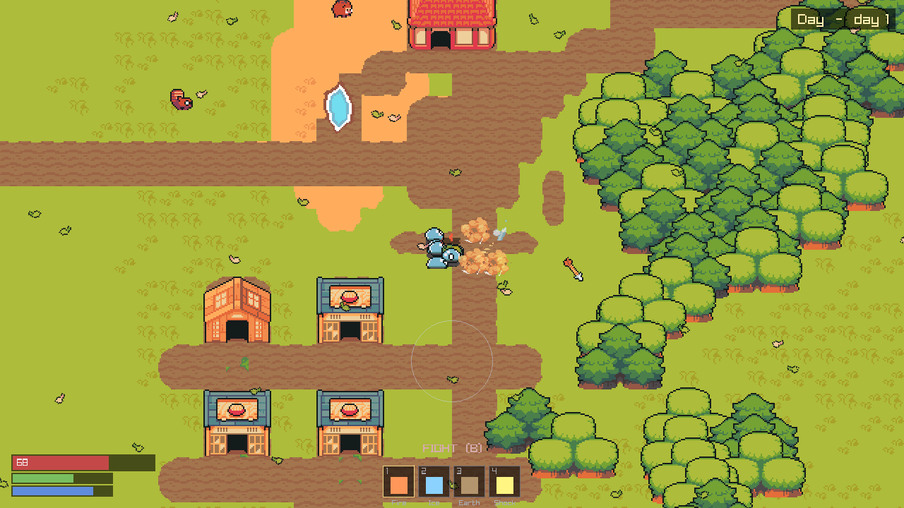
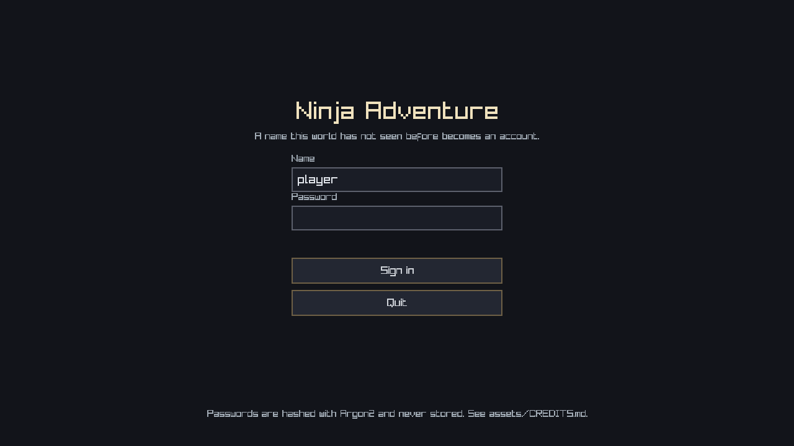
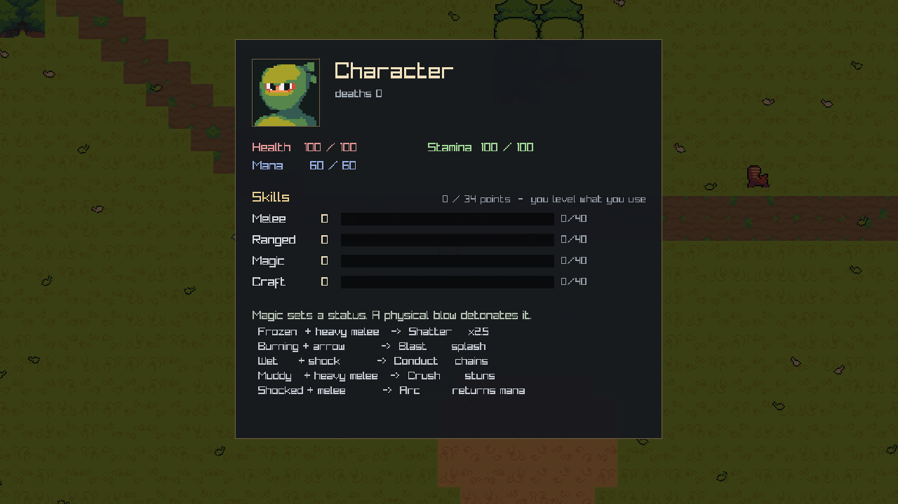
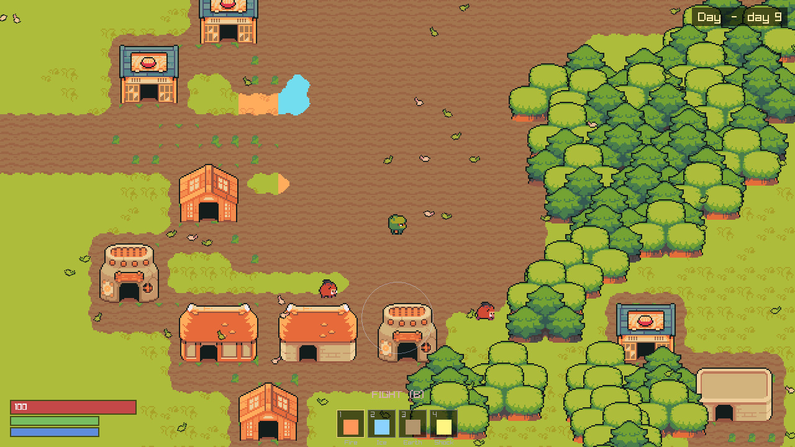

# Ninja Adventure

You wake in open country with forty sticks of wood and no idea where you are. Somewhere out there
are villages, joined by roads. Walk until you find one. Built on the
[QuarkCpp](../QuarkCpp) actor engine.

**Chill is the default; challenge is opt-in.** Nothing is counting down behind you.

| Doc | What |
|---|---|
| [GAME.md](GAME.md) | world, story, and every gameplay system |
| [ARCHITECTURE.md](ARCHITECTURE.md) | technical plan (§0 = design errors being corrected) |
| [ROADMAP.md](ROADMAP.md) | phased plan, P0 → P9 |
| [RENDER_SPEC.md](RENDER_SPEC.md) | how the world is assembled on screen — and one measurement that turned out to be wrong |

> **P0, P1 and P2 are done.** The world generates itself — **51 villages, 27 strongholds and 519
> buildings** across a 1024×1024 overworld — and it is now inhabited: ~620 animals that mostly want
> nothing to do with you, four kinds of monster whose species depends on which ring sent them, and a
> combat system where **magic sets a status and a physical blow detonates it**. Sign in, walk,
> fight, die, wake at your hearth. Next is [P3](ROADMAP.md): village tiers, claims, biome rules.


<sub>The whole 1024×1024 overworld, exported by `mmo_worldmap`. White crosses are villages (bigger =
higher tier), red are strongholds, cyan is where a new player wakes up. Difficulty radiates out from
the centre: Meadow, Forest, Wetland (swamp west / desert east), Snow, Wasteland — and so does
loneliness, 22 → 13 → 5 → 9 → 2 villages against 4 → 7 → 2 → 6 → 8 strongholds.</sub>



<sub>Ice froze the slimes — they are tinted the colour of the spell that did it — and a heavy blow
shattered one. The arrow is chunk state, migrating between actors exactly like a creature does.
Nothing on this screen was placed by hand, including the village.</sub>

### Screens

| | |
|---|---|
|  |  |
|  |  |

### Biomes

| | |
|---|---|
|  |  |
| **Meadow** — the chill ring, 26% of the map | **Forest** |
|  |  |
| **Wetland** — desert east, swamp west | **Snow** |
|  |  |
| **Wasteland** | **A stronghold** — where raids come from |

| | |
|---|---|
|  |  |
| A tier-5 village in the meadow ring | The same world at night |

<sub>`./build/mmo_client --shot 20 out.png --ring N` parks the camera in biome ring N;
`--village N` and `--hold N` point it at a settlement, `--fight N` stages a scrap first.
`mmo_worldmap` prints one village index per ring to feed it.</sub>

## Build & run

Requires CMake ≥ 3.24 and a C++23 compiler (verified: g++ 14.2, and MSVC on Windows).

```bash
# Headless simulation — the whole world, no display. This is also what a cluster node runs.
cmake -S . -B build
cmake --build build -j4                       # -j4, never -j$(nproc)
taskset -c 0-3 ./build/mmo_sim 1200           # 1200 ticks = 120 s of world time; exits 0 on pass

# Graphical client (fetches raylib 5.5 on first configure)
cmake -S . -B build -DMMO_BUILD_CLIENT=ON
cmake --build build -j4 --target mmo_client
taskset -c 0-3 ./build/mmo_client

# Verify the renderer without a display: fast-forwards and writes one frame
xvfb-run -a ./build/mmo_client --shot 20 fight.png --village 25 --fight 12

# Export the whole overworld as a PNG, with ring/terrain/settlement statistics
./build/mmo_worldmap --rings --out worldmap.png
```

Art is committed as `assets/atlas.png`. To change it, see [`assets/CREDITS.md`](assets/CREDITS.md);
to regenerate it from the upstream CC0 packs:

```bash
tools/fetch_assets.sh          # downloads the source packs into assets/_src/
tools/build_atlas.py           # repacks assets/atlas.png + src/render/atlas_slots.hpp
tools/verify_structures.py x.png   # review every multi-tile crop at 6x BEFORE trusting it
```

`-DQUARK_DIR=/path/to/QuarkCpp` if the engine is not at `../QuarkCpp`.

## Signing in

A name this world has not seen before **becomes an account** — there is no registration step, the
same way there is none on a Minecraft server. Passwords are hashed with Argon2i (32 MiB, three
passes, a fresh salt each) via [Monocypher](third_party/monocypher), one vendored `.c` file, and are
never stored.

That is not defence against an attacker breaking into a friend's game server. It is because
**players reuse passwords** and open-source games get their save files passed around: leaking a
plaintext password file would leak your friends' email accounts, which is not a risk this project is
entitled to take on their behalf.

> **Not yet encrypted in transit.** There is no network yet, so there is nothing to encrypt — but
> when `SecureTransport` lands at P6, passwords will cross the wire in the clear until it does.

## Controls

| | |
|---|---|
| `WASD` / arrows | move |
| `B` | swap between **fighting** and **building** |
| Left mouse | swing (hold `Shift` for a heavy blow) |
| Right mouse | cast the selected school at the cursor |
| `Q` / `Space` | loose an arrow at the cursor |
| `1` – `4` | fire / ice / earth / shock (hearth / plot in build mode) |
| `R` | mount up — faster, but you cannot fight from the saddle |
| `E` | harvest a ripe crop |
| `T` / `U` | till a tile / upgrade what is under the cursor |
| `C` | character sheet |
| `J` | journal (controls, tips) |
| `F3` | debug overlay |
| `Esc` | pause / back |
| Wheel | zoom |

## Fighting

Magic **sets** a status; a physical blow **detonates** it. That is the whole system, and every
combo below is a window you aim for rather than a state you park something in — detonating consumes
the status, and a creature carries only one at a time.

| Status (from) | Blow | Result |
|---|---|---|
| Frozen (ice) | heavy melee | **Shatter** — ×2.5 |
| Burning (fire) | arrow | **Blast** — splash |
| Wet | shock | **Conduct** — chains to every wet thing nearby |
| Muddy (earth) | heavy melee | **Crush** — stuns |
| Shocked | melee | **Arc** — returns mana |

Most of what lives out there is not hunting you. Disposition is **state, not species**: crowd a boar
and it will mind, hit a wolf and the whole pack minds, and each time you provoke the same animal it
stays angry longer. Death costs you the walk back and nothing else — no dropped gear, no lost XP.

## What maps to what

| Game concept | Quark concept | Where |
|---|---|---|
| A 32×32-tile chunk | one actor, sole writer of its contents | `src/world/chunk_actor.hpp` |
| A creature walking across a chunk border | `tell` to the neighbouring actor — a network frame once distributed | `ChunkActor::step_creatures` |
| An arrow in flight | the same hand-off, deliberately: one mechanism, not two | `ChunkActor::step_projectiles` |
| A player's identity, vitals, skills, inventory | `Placement<HashById, Require<Trusted>>` — cannot be hosted on a player's machine | `src/world/player_actor.hpp` |
| "May I swing, and how hard?" | `ask` — check-and-debit against stamina, atomic because the actor is `Sequential` | `PlanAttack` |
| Where the players are | published snapshot (tier A→A) then `PlayerBeacon` (A→B) — never an `ask` on a hot path | `src/world/map_director.hpp` |
| Day/night + raid rolls | one trusted actor fanning a `Tick` to every chunk and every player | `src/world/map_director.hpp` |
| Drawing | published immutable snapshots, never an `ask` in the render loop | `src/world/snapshot.hpp` |
| Villages, roads, strongholds | derived from the seed once, then const — broadcast by construction | `src/world/worldgen.hpp` |
| Sprites | one packed atlas; enum→slot is the only art coupling in C++ | `tools/build_atlas.py` |

The world is **1024 chunk actors** plus **8 player slots** over one 1024×1024-tile overworld.

## Two kinds of world data

Terrain is a **pure function** of `(seed, x, y)`: any node computes any tile without asking anyone,
and a chunk re-placed after a node failure regenerates its own ground from its key alone.

A village cannot work that way — deciding where one belongs needs to know where the *others* are.
So generation runs once and writes **one byte per tile**, and `terrain_of` reads that overlay before
falling back to noise. It is still a free function callable for any tile, which is the property that
lets a chunk test the tile a creature is stepping onto without a cross-actor read. The overlay is
derived from the seed, so every node builds a byte-identical copy on its own: broadcast by
construction rather than by message, exactly like the flow field.

## The interest set arrived early, from the other direction

Creatures need the players' positions every tick, so the director pushes a `PlayerBeacon` to the 5×5
chunks around each player instead of anyone asking. It is soft state with a lease: a chunk forgets a
beacon it has not heard in 12 ticks, so nothing has to send "player left", a lost beacon self-heals,
and a chunk re-placed after a node failure simply learns the roster again on the next beat.

The unplanned payoff is that **that roster is the interest set**. Wildlife made almost no chunk
empty any more, so the old LOD rule ("an empty chunk publishes rarely") would have quietly stopped
saving anything. The right rule — and always was — is "publish at full rate only when someone could
be looking", and the beacon list is exactly that predicate, for free. P6 will reuse the same list to
decide which chunks to stream to which client.

## Layout

```
src/world/       simulation — depends on quark, knows nothing about rendering
  tiles.hpp        geometry, entity PODs, factions, statuses, combos, the terrain FUNCTION
  worldgen.hpp     villages, roads, strongholds; the overlay terrain_of reads
  account.hpp      the account table; Argon2 via Monocypher
  flow_field.hpp   multi-source BFS to the nearest village; only hostile creatures use it
  protocol.hpp     every message in the game
  snapshot.hpp     the render seam (IRenderBridge) + SnapshotBus + PlayerBus
  chunk_actor.hpp  the 32x32 chunk: creatures, projectiles, effects, crops, buildings, combat
  player_actor.hpp trusted-tier state: identity, position, vitals, skills, inventory
  map_director.hpp world clock, day/night, raid rolls, beacon fan-out
  world.hpp        bring-up: layout, engine, pools, player roster, chunks, director
src/render/      raylib backend — the ONLY files that know raylib exists
  atlas_slots.hpp  GENERATED by tools/build_atlas.py — slot enum + atlas rects
  ui_sprites.hpp   one keyhole so the UI can draw a portrait without a second atlas
src/ui/          the shell: sign-in, menus, HUD, character sheet (raygui lives here only)
src/sim_main.cpp   headless runner + invariant checks
src/client_main.cpp graphical client
src/worldmap_main.cpp  full-map PNG exporter + generation statistics
src/probe_main.cpp  diagnostic: terrain histogram, ASCII map, reachability, creature trace
third_party/monocypher/  Argon2 (one .c file, BSD-2/CC0)
assets/          atlas.png (committed), tile_index.json (5225 tiles), CREDITS.md
tools/           build_atlas.py (packer), verify_structures.py (crop review), contact_sheet.py
```

`mmo_sim` links none of `src/render/`. If simulation code ever reached into a renderer, it would
stop linking — that is the seam's enforcement mechanism, not a convention.

## Status

Working today, single process:

- 1024 chunk actors ticking at 10 Hz, day/night cycle, random nightly raids out of strongholds
- world generation: villages by ring, roads joining them, strongholds denser toward the rim
- accounts (Argon2), eight keyed player slots, and every verb in the game carrying a player key
- combat: melee, heavy melee, arrows as migrating chunk state, four schools, five statuses, five combos
- ~620 animals with factions and a disposition that is *state* — provoked, remembered, cooled off
- creature difficulty by ring: HP ×1→×5, damage ×1→×3.2, and a different species out of each ring
- action-based XP across four skills with a total point cap; death and respawn at your hearth
- coherent terrain (lakes, beaches, forests) with flow-field pathing for hostiles only
- buildings placed **whole**, as multi-tile sprites, with solid footprints
- ambience: leaves in the meadow, rain in the wetland, snow in the north — all closed-form, no state
- creatures and arrows migrating across chunk (actor) boundaries — thousands per run
- simulation LOD driven by the beacon roster: a chunk nobody can see republishes every 32nd tick

Not yet: village tiers and claims (P3), crafting and equipment (P4), persistence (P5), multi-process
cluster and `RelayTransport` (P6).
