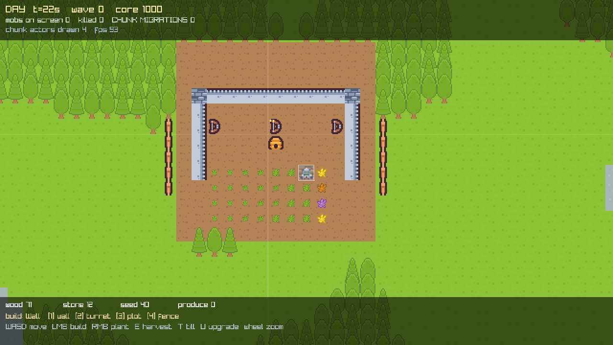
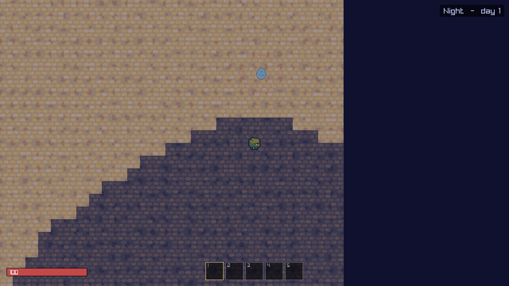

# Ninja Adventure

A retired ninja comes home to farm. Grow crops, keep chickens, rebuild the fence — and step through
a gate when you feel like an adventure. Built on the [QuarkCpp](../QuarkCpp) actor engine.

**Chill is the default; challenge is opt-in.** Nothing is counting down behind you.

| Doc | What |
|---|---|
| [GAME.md](GAME.md) | world, story, and every gameplay system |
| [ARCHITECTURE.md](ARCHITECTURE.md) | technical plan (§0 = design errors being corrected) |
| [ROADMAP.md](ROADMAP.md) | phased plan, P0 → P8 |

> **P0 is done** — MIT licence, the demo-era "core you must defend" is gone, characters and monsters
> are animated Ninja Adventure sprites, and the controls that used to be printed over the world now
> live in a journal behind a real menu. See [ROADMAP.md](ROADMAP.md) for what P1 brings, and
> [GAMEPLAY.md](GAMEPLAY.md) for what the current build actually does.


<sub>The whole 1024x1024 overworld, exported by `mmo_worldmap`. Difficulty radiates out from the
centre: Meadow, Forest, Wetland (swamp west / desert east), Snow, Wasteland.</sub>



<sub>Day: the walled farm, turrets (gold pips mark upgrade level), flanking fences, crops at four
growth stages.</sub>



<sub>A spawn camp at night, and the column of monsters the flow field funnels out of it — the
approach lane a wall is worth building across. Night and mid-siege frames are in [`docs/`](docs).</sub>

## Build & run

Requires CMake ≥ 3.24 and a C++23 compiler (verified: g++ 14.2).

```bash
# Headless simulation — the whole world, no display. This is also what a cluster node runs.
cmake -S . -B build
cmake --build build -j4                       # -j4, never -j$(nproc)
taskset -c 0-3 ./build/mmo_sim 1200           # 1200 ticks = 120 s of world time; exits 0 on pass

# Graphical client (fetches raylib 5.5 on first configure)
cmake -S . -B build -DMMO_BUILD_CLIENT=ON
cmake --build build -j4 --target mmo_client
taskset -c 0-3 ./build/mmo_client

# Verify the renderer without a display: fast-forwards, seeds a farm, writes one frame
xvfb-run -a ./build/mmo_client --shot 100 siege.png

# Export the whole overworld as a PNG, with ring/terrain statistics
./build/mmo_worldmap --rings --out worldmap.png
```

Art is committed as `assets/atlas.png`. To change it, see [`assets/CREDITS.md`](assets/CREDITS.md);
to regenerate it from the upstream CC0 packs:

```bash
tools/fetch_assets.sh     # downloads 3 Kenney packs into assets/_src/, rebuilds the atlas
```

`-DQUARK_DIR=/path/to/QuarkCpp` if the engine is not at `../QuarkCpp`.

## Controls

| | |
|---|---|
| `WASD` / arrows | move |
| Left mouse | build the selected structure |
| Right mouse | plant wheat (tilled soil only) |
| `E` | harvest a ripe crop |
| `T` | till a tile — expand the farm past the starting apron |
| `U` | upgrade the building under the cursor (levels 1–3) |
| `1`–`5` | hotbar |
| `J` | journal (controls, tips) |
| `F3` | debug overlay |
| `Esc` | pause / back |
| Wheel | zoom |

## What maps to what

| Game concept | Quark concept | Where |
|---|---|---|
| A 32×32-tile chunk | one actor, sole writer of its contents | `src/world/chunk_actor.hpp` |
| A mob walking across a chunk border | `tell` to the neighbouring actor — a network frame once distributed | `ChunkActor::step_mobs` |
| Player inventory | `Placement<HashById, Require<Trusted>>` — cannot be hosted on a player's machine | `src/world/player_actor.hpp` |
| Day/night + wave scheduling | one trusted actor fanning a `Tick` to every chunk | `src/world/map_director.hpp` |
| Buying a building | `ask` (check-and-debit, atomic because the actor is `Sequential`) | `World::build_at` |
| Drawing | published immutable snapshots, never an `ask` in the render loop | `src/world/snapshot.hpp` |
| Sprites | one packed atlas; enum→slot is the only art coupling in C++ | `tools/build_atlas.py` |

The world is **192 chunk actors** across 3 maps of 256×256 tiles each.

## Layout

```
src/world/       simulation — depends on quark, knows nothing about rendering
  tiles.hpp        geometry, entity PODs, deterministic RNG, the terrain FUNCTION (value noise)
  flow_field.hpp   BFS distance-to-core; why a shared lookup table is not shared mutable state
  protocol.hpp     every message in the game
  snapshot.hpp     the render seam (IRenderBridge) — the only thing a renderer sees
  chunk_actor.hpp  the 32x32 chunk: mobs, crops, buildings, migration
  player_actor.hpp trusted-tier state: position, health, inventory
  map_director.hpp world clock, day/night, wave scheduling
  world.hpp        bring-up: engine, pools, actors, refs
src/render/      raylib backend — the ONLY file that knows raylib exists
  atlas_slots.hpp  GENERATED by tools/build_atlas.py — slot enum + atlas rects
src/sim_main.cpp   headless runner + invariant checks
src/client_main.cpp graphical client
src/probe_main.cpp  diagnostic: terrain histogram, ASCII map, reachability, mob trace
assets/          atlas.png (committed) + CREDITS.md; _src/ is fetched, not committed
tools/           build_atlas.py (packer), atlas_preview.py (tile picker), fetch_assets.sh
```

`mmo_sim` links none of `src/render/`. If simulation code ever reached into a renderer, it would
stop linking — that is the seam's enforcement mechanism, not a convention.

## Status

Working today, single process:

- 192 chunk actors ticking at 10 Hz, day/night cycle, escalating night waves
- coherent terrain (lakes, beaches, forests) with flow-field pathing around obstacles
- five fixed spawn camps feeding predictable approach lanes, not a 360-degree rim
- solid buildings: fences and walls actually block, upgrades to level 3, free base expansion
- mobs pathing across chunk (actor) boundaries — 560+ migrations in a 2-minute run
- crops growing on wall-clock time, turrets firing, buildings taking damage, core destructible
- trusted-tier inventory that refuses unaffordable builds atomically
- raylib client with Kenney CC0 pixel art, chunk-boundary overlay and a live migration counter

Not yet: multi-process cluster (needs the Windows PAL backend, tracked upstream in QuarkCpp),
`RelayTransport` for NAT, persistence, multiple simultaneous players.
