# Ninja Adventure

You wake in open country with forty sticks of wood and no idea where you are. Somewhere out there
are villages, joined by roads. Walk until you find one. Built on the
[QuarkCpp](../QuarkCpp) actor engine.

**Chill is the default; challenge is opt-in.** Nothing is counting down behind you.

| Doc | What |
|---|---|
| [GAME.md](GAME.md) | world, story, and every gameplay system |
| [ARCHITECTURE.md](ARCHITECTURE.md) | technical plan (§0 = design errors being corrected) |
| [ROADMAP.md](ROADMAP.md) | phased plan, P0 → P9 |

> **P0 and P1 are done.** The world now generates itself: **49 villages, 23 strongholds and 493
> buildings** across a 1024×1024 overworld, joined by roads, with difficulty radiating outward from
> the middle. The first world is **entirely Ninja Adventure art** — no Kenney tiles left in it.
> Next is [P2](ROADMAP.md): the player, and combat.

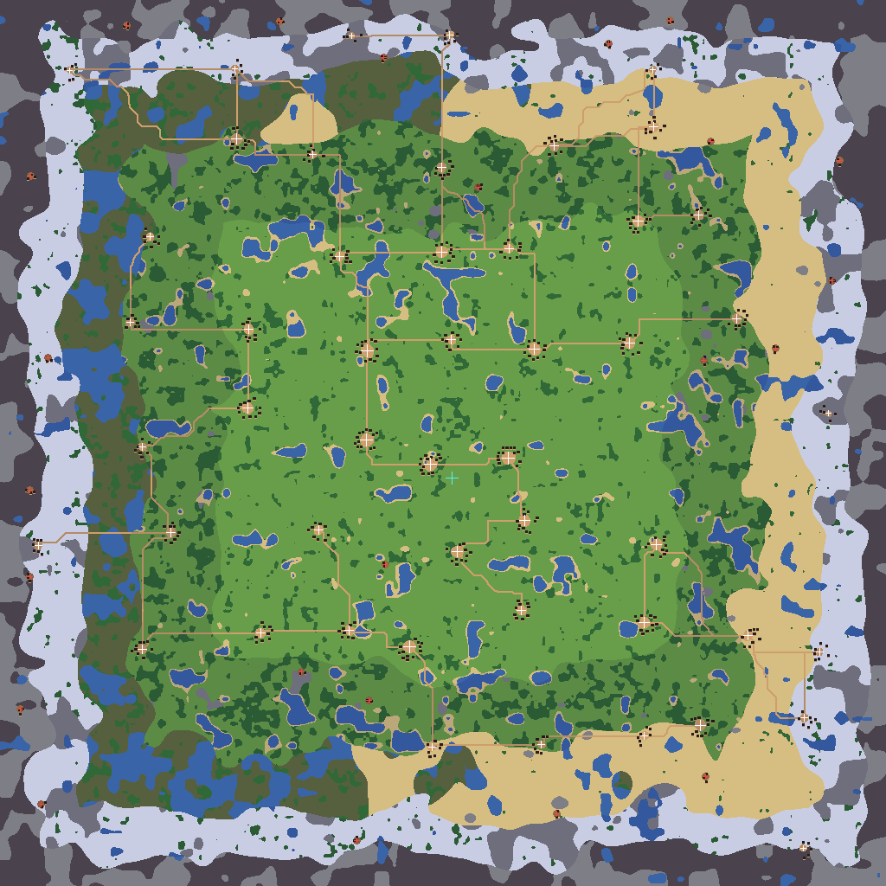

<sub>The whole 1024×1024 overworld, exported by `mmo_worldmap`. White crosses are villages (bigger =
higher tier), red are strongholds, cyan is where a new player wakes up. Difficulty radiates out from
the centre: Meadow, Forest, Wetland (swamp west / desert east), Snow, Wasteland — and so does
loneliness, 22 → 12 → 5 → 9 → 1 villages against 1 → 4 → 4 → 6 → 8 strongholds.</sub>

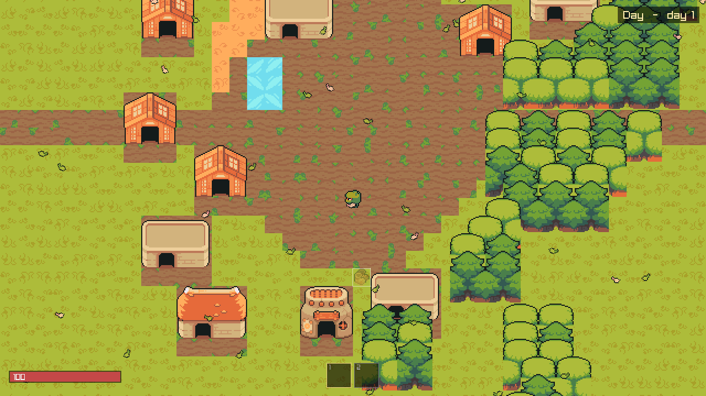

<sub>A tier-5 village in the meadow ring: houses placed whole, a trodden square, a road running
through, leaves on the wind. Nothing here was placed by hand.</sub>

### Screens

| | |
|---|---|
| 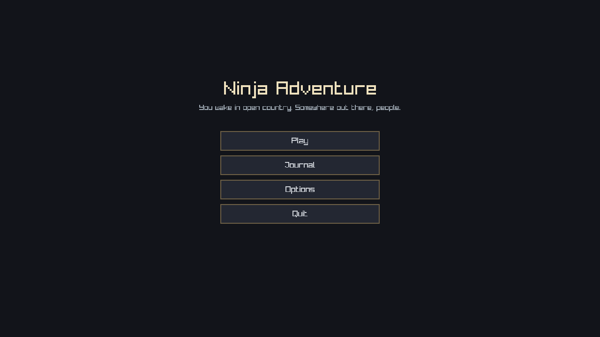 | 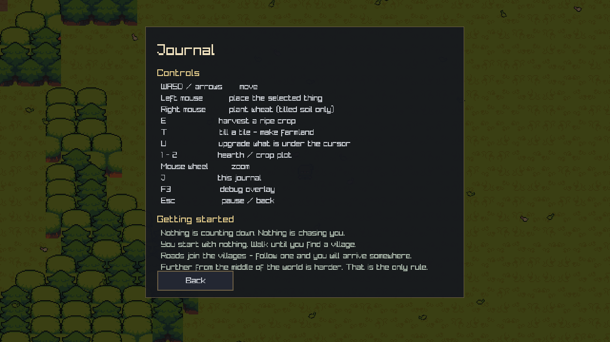 |

### Biomes

| | |
|---|---|
| 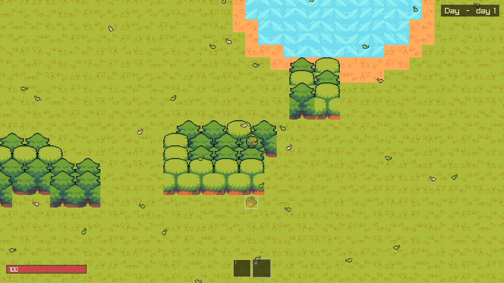 | 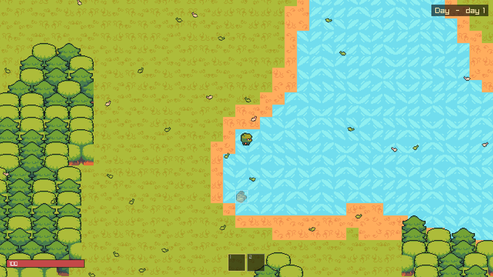 |
| **Meadow** — the chill ring, 26% of the map | **Forest** |
| 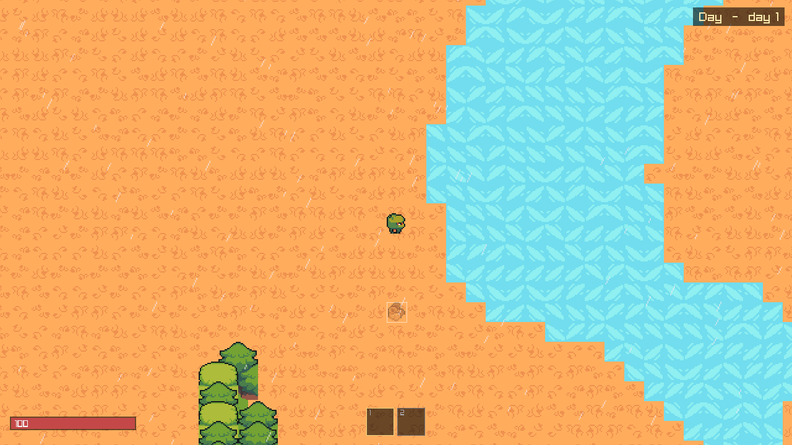 | 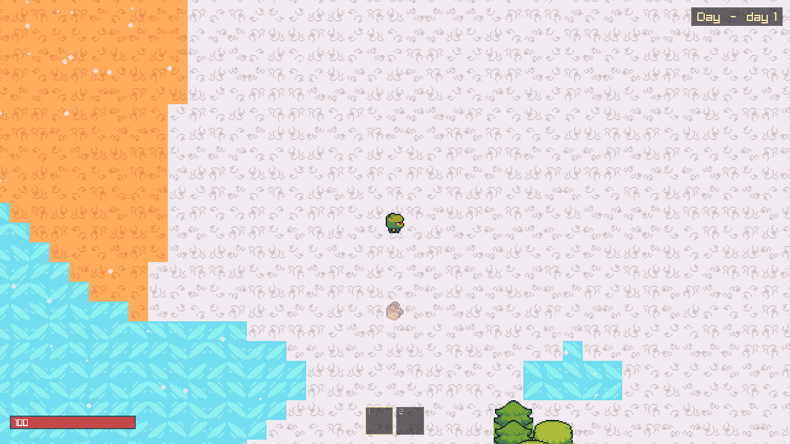 |
| **Wetland** — desert east, swamp west | **Snow** |
| 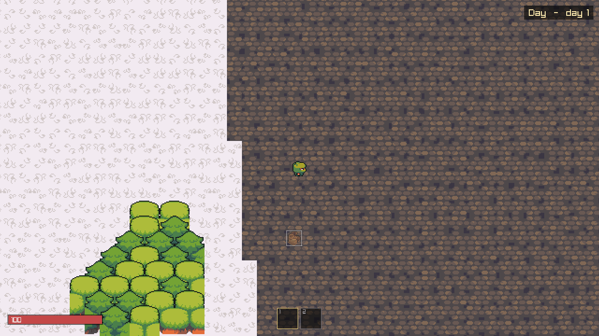 | 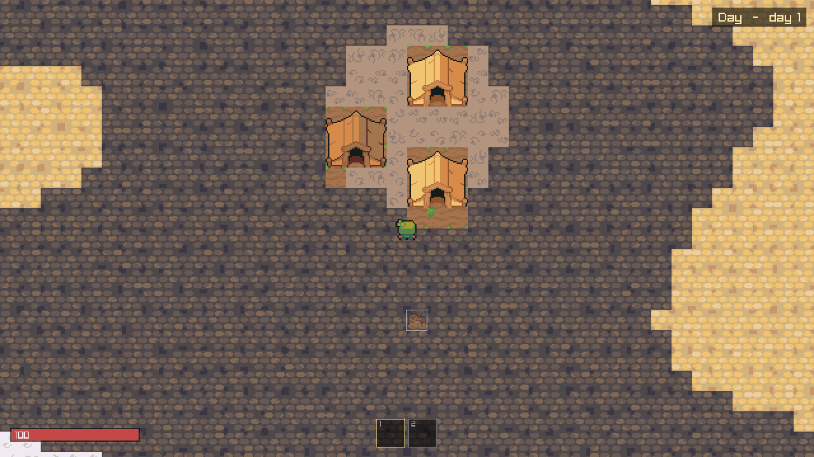 |
| **Wasteland** | **A stronghold** — where raids come from |

| | |
|---|---|
| 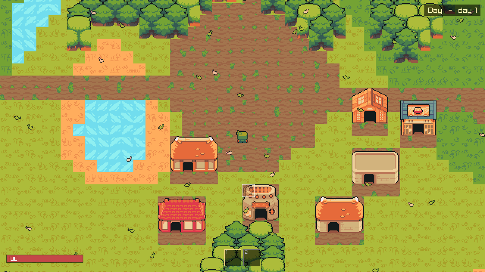 | 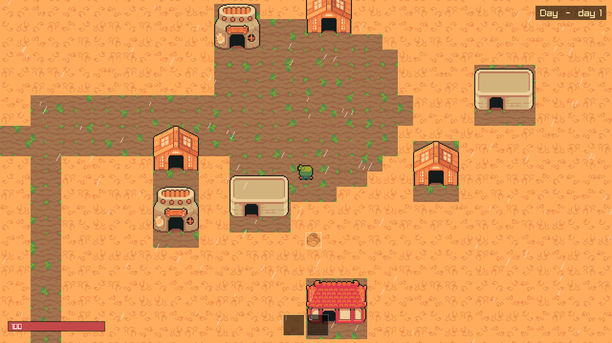 |
| A forest village | A village on the desert edge |

<sub>`./build/mmo_client --shot 20 out.png --ring N` parks the camera in biome ring N;
`--village N` and `--hold N` point it at a settlement. `mmo_worldmap` prints one village index per
ring to feed it.</sub>

## Build & run

Requires CMake ≥ 3.24 and a C++23 compiler (verified: g++ 14.2, and MSVC on Windows).

```bash
# Headless simulation — the whole world, no display. This is also what a cluster node runs.
cmake -S . -B build
cmake --build build -j4                       # -j4, never -j$(nproc)
taskset -c 0-3 ./build/mmo_sim 1200           # 1200 ticks = 120 s of world time; exits 0 on pass

# Graphical client (fetches raylib 5.5 on first configure)
cmake -S . -B build -DMMO_BUILD_CLIENT=ON
cmake --build build -j4 --target mmo_client
taskset -c 0-3 ./build/mmo_client

# Verify the renderer without a display: fast-forwards and writes one frame
xvfb-run -a ./build/mmo_client --shot 20 village.png --village 26

# Export the whole overworld as a PNG, with ring/terrain/settlement statistics
./build/mmo_worldmap --rings --out worldmap.png
```

Art is committed as `assets/atlas.png`. To change it, see [`assets/CREDITS.md`](assets/CREDITS.md);
to regenerate it from the upstream CC0 packs:

```bash
tools/fetch_assets.sh          # downloads the source packs into assets/_src/
tools/build_atlas.py           # repacks assets/atlas.png + src/render/atlas_slots.hpp
tools/verify_structures.py x.png   # review every multi-tile crop at 6x BEFORE trusting it
```

`-DQUARK_DIR=/path/to/QuarkCpp` if the engine is not at `../QuarkCpp`.

## Controls

| | |
|---|---|
| `WASD` / arrows | move |
| `1` / `2` | hearth / crop plot |
| Left mouse | place the selected thing |
| Right mouse | plant wheat (tilled soil only) |
| `E` | harvest a ripe crop |
| `T` | till a tile — make farmland |
| `U` | upgrade what is under the cursor |
| `J` | journal (controls, tips) |
| `F3` | debug overlay |
| `Esc` | pause / back |
| Wheel | zoom |

## What maps to what

| Game concept | Quark concept | Where |
|---|---|---|
| A 32×32-tile chunk | one actor, sole writer of its contents | `src/world/chunk_actor.hpp` |
| A mob walking across a chunk border | `tell` to the neighbouring actor — a network frame once distributed | `ChunkActor::step_mobs` |
| Player inventory | `Placement<HashById, Require<Trusted>>` — cannot be hosted on a player's machine | `src/world/player_actor.hpp` |
| Day/night + raid rolls | one trusted actor fanning a `Tick` to every chunk | `src/world/map_director.hpp` |
| Lighting a hearth | `ask` (check-and-debit, atomic because the actor is `Sequential`) | `World::build_at` |
| Drawing | published immutable snapshots, never an `ask` in the render loop | `src/world/snapshot.hpp` |
| Villages, roads, strongholds | derived from the seed once, then const — broadcast by construction | `src/world/worldgen.hpp` |
| Sprites | one packed atlas; enum→slot is the only art coupling in C++ | `tools/build_atlas.py` |

The world is **1024 chunk actors** over one 1024×1024-tile overworld.

## Two kinds of world data

Terrain is a **pure function** of `(seed, x, y)`: any node computes any tile without asking anyone,
and a chunk re-placed after a node failure regenerates its own ground from its key alone.

A village cannot work that way — deciding where one belongs needs to know where the *others* are.
So generation runs once and writes **one byte per tile**, and `terrain_of` reads that overlay before
falling back to noise. It is still a free function callable for any tile, which is the property that
lets a chunk test the tile a mob is stepping onto without a cross-actor read. The overlay is derived
from the seed, so every node builds a byte-identical copy on its own: broadcast by construction
rather than by message, exactly like the flow field.

## Layout

```
src/world/       simulation — depends on quark, knows nothing about rendering
  tiles.hpp        geometry, entity PODs, deterministic RNG, the terrain FUNCTION (value noise)
  worldgen.hpp     villages, roads, strongholds; the overlay terrain_of reads
  flow_field.hpp   multi-source BFS to the nearest village; why a lookup table is not shared state
  protocol.hpp     every message in the game
  snapshot.hpp     the render seam (IRenderBridge) — the only thing a renderer sees
  chunk_actor.hpp  the 32x32 chunk: mobs, crops, buildings, migration, simulation LOD
  player_actor.hpp trusted-tier state: position, health, inventory
  map_director.hpp world clock, day/night, raid rolls
  world.hpp        bring-up: layout, engine, pools, actors, refs
src/render/      raylib backend — the ONLY file that knows raylib exists
  atlas_slots.hpp  GENERATED by tools/build_atlas.py — slot enum + atlas rects
src/sim_main.cpp   headless runner + invariant checks
src/client_main.cpp graphical client
src/worldmap_main.cpp  full-map PNG exporter + generation statistics
src/probe_main.cpp  diagnostic: terrain histogram, ASCII map, reachability, mob trace
assets/          atlas.png (committed), tile_index.json (5225 tiles), CREDITS.md
tools/           build_atlas.py (packer), verify_structures.py (crop review), contact_sheet.py
```

`mmo_sim` links none of `src/render/`. If simulation code ever reached into a renderer, it would
stop linking — that is the seam's enforcement mechanism, not a convention.

## Status

Working today, single process:

- 1024 chunk actors ticking at 10 Hz, day/night cycle, random nightly raids out of strongholds
- world generation: villages by ring, roads joining them, strongholds denser toward the rim
- coherent terrain (lakes, beaches, forests) with flow-field pathing to the nearest village
- buildings placed **whole**, as multi-tile sprites, with solid footprints
- ambience: leaves in the meadow, rain in the wetland, snow in the north — all closed-form, no state
- mobs pathing across chunk (actor) boundaries — 100+ migrations in a 2-minute run
- crops growing on wall-clock time; trusted-tier inventory that refuses unaffordable builds atomically
- simulation LOD: an empty chunk still ticks but republishes only every 32nd tick

Not yet: combat of any kind (P2 — there are no turrets any more and nothing stops a raid), multi-
process cluster, `RelayTransport` for NAT, persistence, multiple simultaneous players.
